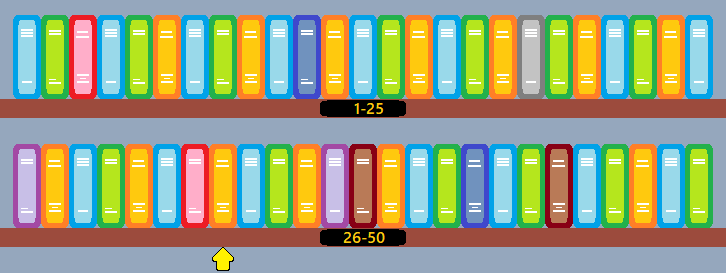

### Big O Notation

[Home](0-Welcome.md)
[Next - Stacks](1-Stacks.md)

#### Common Ground
Before we start analyzing different data structures, we need a method to evaluate them. We will be using one prominent metric called Big O Notation. We can break down how efficient a particular algorithm may be, and so we can measure the efficiency of our data structures.

The following will be a brief overview. And don't worry if you understand it all immediately. It will get easier to use as we use it later.

#### Linear Performance - Find a Book
Let's say you need to find a book on a library shelf. The books are not sorted, so the only way you can find them is by checking every book on the shelf.
If there are 50 books on the shelf and the book you are looking for is the 12th one, then it would take 12 checks. 


More generally, it takes 12 operations to find your book. In Python, this would check every item in an array until we found our book. We can see an example here:
```python
from random import shuffle
books = list(range(1,51)) # Books 1-50
# Shuffling the books
shuffle(books)

my_book = 12
book_found = False
for book in books:
    if my_book == book:
        book_found = True
        break

if book_found:
    print('Found it!')
else:
    print('Book not found.')
```
For this overview, Big O means we are concerned about the worst-case scenario, where we do the most work. If our book was at the end, then we would have to do 50 operations to find it.
In general, if there are **n** items, then in the worst case we must check n items. We write this as O(**n**), and we say the problem has a Linear Performance. This is because we perform one operation for each item in our list. So, whether there are 50 items to check or 50 million items, we write its performance as O(**n**).

#### Polynomial Performance - Sort the Shelf
Let's say we want to organize our bookshelf. In this case, we will use a bubble sort. In a bubble sort, we start from the first item and compare it to the next. If the first item is bigger than the second, then they swap places. If not, nothing happens. We then move to the second item and compare it to the third. Once we make it to the end, we start from the beginning. The code for this is written in Python here:
```python
# This is not the most efficient bubble sort.
from random import shuffle
books = list(range(1,51)) # Books 1-50
# Shuffling books
shuffle(books)

for i in range(len(books)):
    # Each time we finish a 'j' loop we check if
    # any swaps happened. We are done sorting when
    # a swap does not occur.
    swap_occured = False

    for j in range(len(books)-1):
        if books[j] > books[j+1]:
            # Swapping values
            books[j], books[j+1] = books[j+1], books[j]
            # Swap has occured
            swap_occured = True

    # Checking if swap occurred.
    if not swap_occured:
        break

print(books) # [1,2...49,50]
```
Inside loop 'j' we check every book in the list. Each time j finishes, the largest value is moved to the end. But to find out the Big-O for this algorithm, we find the worst case. 

If our shelf was in reverse order (**50,49...2,1**), then all values will be swapped each time we go through 'j', or **n** swaps. And since we will have a swap each time we go through 'j', 'i' will loop the maximum amount, in this case, **n**. So, the maximum operations that will happen are **n * n**, or **n^2**.

Polynomial-time in Big-O means that the operations we need to perform go up exponentially with our input size. Polynomial time is slower and more costly than linear time. It is written O(**n^m**), such as O(**n^2**) or O(**n^3**).

#### Logarithmic Performance

Logarithmic Performance is much more efficient than Linear or Polynomial-time. Logarithmic time occurs when you reduce how much work you need to do with each operation performed. For that, we can take another look at the bookshelf.


This time around, you need to find another book, number **33**. But since we sorted our bookshelf, we can find our books much more quickly. To find our book, we will start at the middle of our books, **26**. We know that our book is after **26**, so we can eliminate half of the books we will look through. So next we look at the middle of what we have left, **26**-**50**. If we look at the middle again of these books, we get **38**. Our book is below this, so now we eliminate the second half of these books to **26**-**37**. From start to finish, we check:
- **(1-50)**, middle is **26**
- **(26-50)**, middle is **38**
- **(26-37)**, middle is **32**
- **(32, 33, 34, 35, 36, 37)**, middle is **35**
- **(32, 33, 34)**, middle is **33**

In total, it took 5 operations to find our book. If we doubled how many books we have to look through, it only takes one more check. This is because we **halve** the number of books to look through with each operation.

[Previous - Welcome](0-Welcome.md)
[Next - Stacks](1-Stacks.md)
