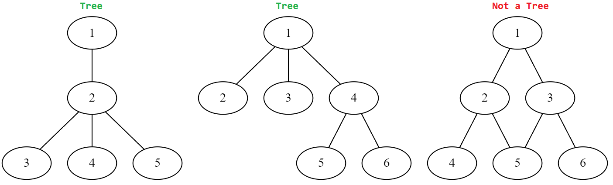
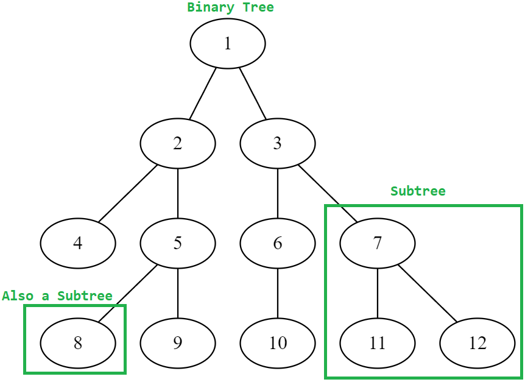

### Trees
- [Home](0-Welcome.md)
- [Previous - Sets](2-Sets.md)

To traverse a **tree** data structure, you have to start at the **root** of the tree. Each **node** in the tree, including the root node, will have a link to other nodes in the tree.
There is only allowed to be one path to any node. If there is more than one path then it is a graph.

#### Vocabulary
For simplicity, we will look at binary trees to show properties of trees. A **binary tree** is a tree where no parent nodes have more than two child nodes. A **parent** node is a node that has nodes branching out, or coming from it. A **child** node is the node coming from a parent node. If a node does not have any children, then it is called a **leaf** node because it is the last one on its branch.

Below is an illustration of some other concepts. The child of any node and its descendants (its children and children's children and so on) can be called a **subtree**. A subtree has been made with 7 and its children. One is also made from leaf node 8, which has no children.

Additionally, the first node in any tree is called the **root** node.


#### Balance
A tree can also be **balanced** or unbalanced. A tree is balanced when most parent nodes are filled out and the levels between the furthest and closest leaf node from the root are not too large. To make the tree we looked at earlier perfectly balanced, we would need to add two nodes to 4 and one node to 6.

An unbalanced tree is when the difference in levels for the leaf nodes is large. Below is an example.


The level difference of the leaf nodes in the first binary tree is only one (4 is three nodes, 9 is down four). But the difference in this one is 2 (2 is one level, 5 and six are three levels down). So our second tree is more unbalanced.
#### Opperation Tree
The following python code is used to evaluate a tree as a mathmatic expression.
```python
# Allows us to use operators *, +, /, - 
import operator
# Assigning text values to their operators
op = {
    '+':operator.add,
    '-':operator.sub,
    '*':operator.mul,
    '/':operator.truediv
}

expression = ['+',2,['/',['*',3,4],['-',6,1]]]
def prefix_evaluation(tree):

    # If node is a tree, then that subtree is
    # evaluated by prefix_evaluation
    if type(tree[1]) is list:
        first = prefix_evaluation(tree[1])
    else:
        first = tree[1]
    
    # If node is a tree, then that subtree is
    # evaluated by prefix_evaluation
    if type(tree[2]) is list:
        second = prefix_evaluation(tree[2])
    else:
        second = tree[2]
    
    # When a node with two leaf nodes is
    # passed in, it is evaluated and returned
    # to the caller.
    return op[tree[0]](first,second)

print(prefix_evaluation(expression))
```


The code above takes a binary tree as input (a nested list). As you follow along with the steps below, it can help to follow the image provided.
1. The first and second ```if``` statements check if we are looking at a subtree. When we pass in our tree named ```expression```, it checks the two children of the Root node **+**.
2. The first child, **2**, is a leaf node, so we don't need to evaluate it further for the final expression.
3. The second child of the root node is a list. We know this is a subtree, and it needs to be evaluated before we can use it in the final expression. So we call **prefix_evaluation** and pass in our subtree, **/**.
4. In this function call, the root node is **/**, and we evaluate its two children like last time.
5. The first and second child of **/** are both subtrees, so we make two calls to have them evaluated. Their values will be returned to **/** when they are done.
6. Since both children of **\*** are leaf nodes (no children), we can evaluate it right away, and we get 12. 12 is returned to **/**.
7. The same happens with **-**, and we evaluate it as 5. 5 is returned to **/**.
8. Now that **/** has both values, we evaluate it and get 2.4, which is returned to **+**.
9. Now we can finish by evaluating **+** with 2 and 2.4, the value we got back from the subtree. The answer is 4.4

#### Try it Yourself - Search for a Value
Below is code for the Node class. Its purpose is to construct a binary tree that sorts the numbers by size.

In this binary sorted tree, values correspond to left and right if they are smaller or larger than their parent, respectively.
1. 26 is smaller than 53, so it was added to the left.
2. 44 is smaller than 53, so it goes left; then we see it is larger than 26, so it goes to the right of 26.

Your task is to write the ```check``` method inside of node. It needs to check if a value is in the binary tree. 

- Your function should return ```True``` or ```False``` when you check for the value.

When you are done, you can compare your solution with the one [here](/code%20examples%20and%20solutions/tree_solution.py).

Here is a visual representation for the provided tree:

```python

class Node:
    def __init__(self, value):
        self.data = value
        self.left = None
        self.right = None

    def insert(self,value):
        # Pass if the value is already in the tree
        if value == self.data:
            pass
        else:
            # If value is less than the node, check
            # left
            if value < self.data:
                # If empty, it becomes left node
                if self.left == None:
                    self.left = Node(value)
                # Otherwise, look in that node
                else:
                    self.left.insert(value)
            # Similar to less then check
            if value > self.data:
                if self.right == None:
                    self.right = Node(value)
                else:
                    self.right.insert(value)

    def check(self, value):
        # Your code goes here
        pass


# Provided tree
tree = Node(53)
numbers = [26,20,44,88,67,94,55,80]
for num in numbers:
    tree.insert(num)

# Pass these checks
print(tree.check(26)) # True
print(tree.check(80)) # True
print(tree.check(91)) # False
```

- [Home](0-Welcome.md)
- [Previous - Sets](2-Sets.md)